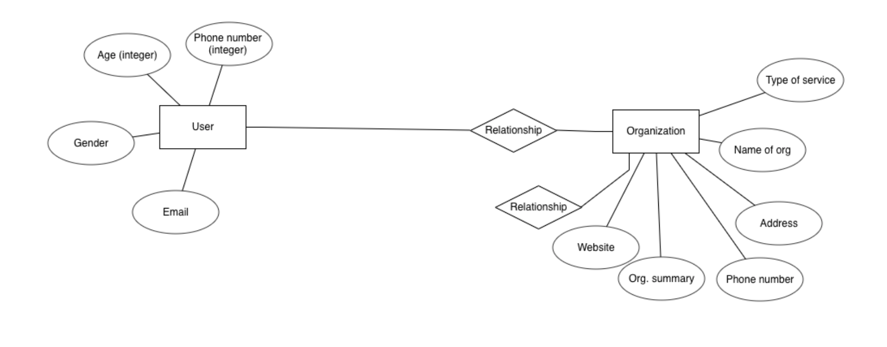

# FINDPEACE

FindPeace was created by Hannah Shea, Sonia St. Remy, Tristan Farvard and Krisi Keranova as our final project for the ten week Full Stack Web Development program at Wyncode Academy. 

FindPeace is an app that gives users the ability to find resources when they are at their most vulnerable. This app is only known through word of mouth by the medical and mental health community to help adults, children and families that find themselves in an unsafe environment due to sexual, physical, mental and verbal abuse. This will also assist user who are seeking HIV testing or  treatment, emergency housing and transitional housing. 

Statistics show that victims of domestic violence are at their most vulnerable when they are both seeking help or are in the process of leaving their current situation. To ensure maximum privacy and our users safety, the app will initially be disguised as a yoga website. 
 
When a medical or mental health professional informs a user in need about this website, the user will learn that if they go to the the drop down menu and click on the 'help' button they will enable a chat-box. The chat-box will present them with several options for them to choose which best describes their current needs. When the user clicks on their choice, a list of resources as well as websites, phone numbers and locations will render. Once the location is selected, the user is presented with a map that gives them directions to that specific location. It was Mahatma Gandhi that said "a nation's greatness is measured by how it treats it's weakest members."
 

# CONTRIBUTERS

* [Hannah Shea](https://github.com/hbshea)
* [Krisi Keranova](https://github.com/krisike)
* [Sonia St.Remy](https://github.com/stremysonia)
* [Tristan Favard](https://github.com/Trsif/)

# Technologies used

* `ruby -> 2.6.0` or higher
* `Mapbox Gl` with a token key
* `Pure CSS` "www.purecss.io"
* `react_on_rails` Gem
* `rails`
* `Adobe XD`
* `postgresql` as the database
* `webpacker` with `react`
* `Canva` "canva.com"

## Deployment

### The Node.js buildback must be added first or precompiling of assets may fail on Heroku: [See this issue](https://github.com/rails/webpacker/issues/1164#issuecomment-443474860)

* `heroku create your-app-name`
* `heroku buildpacks:set --index 1 heroku/nodejs`
* `heroku buildpacks:add heroku/ruby`
* `git push heroku master`
* `heroku run rails db:migrate`
* _optional_: `heroku run rails db:seed`
* `rails db: create db:migrate db:seed`

## ERD

* 
